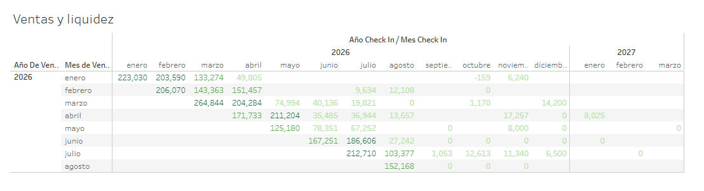

# Dashboard de liquidez hotelera — ventas vs. cobros

Automatización de un proceso que antes se hacía manualmente en Excel: extracción de datos en tiempo real desde el PMS (Property Management System) de un hotel mediante Google Apps Script hacia Google Sheets, conectado después a Tableau, para dar visibilidad a los stakeholders sobre la liquidez del hotel respecto a las ventas y anticipar el flujo de caja futuro.

## Herramientas

Google Apps Script, Google Sheets, Tableau

## Preguntas clave

1. ¿Cuánto se ha vendido por mes, y en qué mes hará check-in cada reserva?
2. ¿Qué proporción de esas ventas ya se ha cobrado y cuánto sigue pendiente por liquidar?
3. ¿Cómo se puede anticipar el flujo de caja futuro del hotel a partir de las reservas ya vendidas?

## Metodología

- **Extracción automatizada:** script en Google Apps Script que mina datos en tiempo real desde el PMS del hotel hacia Google Sheets.
- **Modelado de datos:** cálculo de campos clave — total de habitación con impuestos, extras, monto ya pagado y monto por liquidar.
- **Visualización:** conexión a Tableau y construcción de una matriz cruzada (mes de venta × mes de check-in) que muestra el estado de cobro de cada cohorte de reservas.

## Conclusiones y recomendaciones

- El dashboard reemplazó un proceso manual en Excel, reduciendo tiempo de actualización y margen de error.
- Al cruzar mes de venta con mes de check-in, los stakeholders pueden anticipar qué meses futuros tienen mayor volumen de ventas ya comprometidas y cuánto de ese monto aún no se ha cobrado.
- Esto permite una mejor planeación de flujo de caja, al identificar con anticipación períodos donde la liquidez esperada podría ser menor a lo proyectado.

## Visualizaciones destacadas

🔗 [Ver dashboard interactivo en Tableau Public](https://public.tableau.com/app/profile/hernando.zamora5276/viz/Liquidez_17891531474460/Dashboard1?publish=yes)

## Archivo de Tableau

📊 [Ver archivo del dashboard (.twb)](Liquidez.twb)
